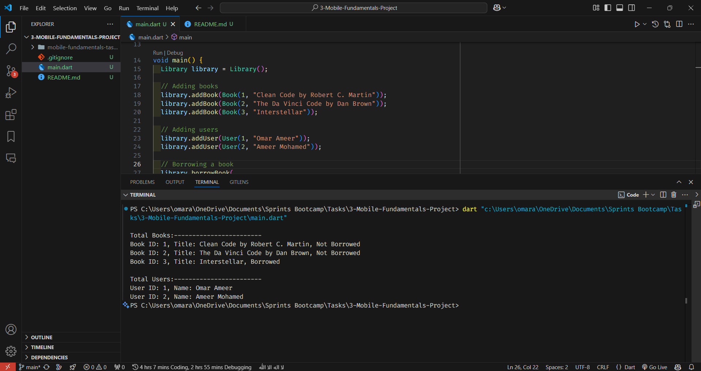

# Create a simple library system that manages borrowed and returned books

This program creates a simple library system that manages borrowed and returned books.

## Requirements

### Requirement 1

**Title:** Create a simple library system
**Description:** The program should create a simple library system that manages borrowed and returned books.

## Code Explanation

```dart
// Book class with id, title, borrowed attributes and displayInfo method
class Book {
  int id;
  String title;
  bool borrowed;

  Book(
    this.id,
    this.title, {
    this.borrowed = false,
  });

  void displayInfo() {
    print(
      "Book ID: $id, Title: $title, " +
          (borrowed ? "Borrowed" : "Not Borrowed"),
    );
  }
}

// User class with id, name attributes and displayInfo method
class User {
  int id;
  String name;

  User(
    this.id,
    this.name,
  );

  void displayInfo() {
    print("User ID: $id, Name: $name");
  }
}

// Library class with list of books, list of users attributes and addBook, return book, borrowBook, displayInfo methods
class Library {
  List<Book> books = [];
  List<User> users = [];

  void addBook(Book book) {
    books.add(book);
  }

  void addUser(User user) {
    users.add(user);
  }

  void borrowBook({
    required int bookId,
    required int userId,
  }) {
    Book book = books.firstWhere((book) => book.id == bookId);
    book.borrowed = true;
  }

  void returnBook({
    required int bookId,
    required int userId,
  }) {
    Book book = books.firstWhere((book) => book.id == bookId);
    book.borrowed = false;
  }

  void displayInfo() {
    print("\nTotal Books:------------------------");
    books.forEach((book) => book.displayInfo());
    print("\nTotal Users:------------------------");
    users.forEach((user) => user.displayInfo());
  }
}
```

## Code Output

```
Total Books:------------------------
Book ID: 1, Title: Clean Code by Robert C. Martin, Not Borrowed
Book ID: 2, Title: The Da Vinci Code by Dan Brown, Not Borrowed
Book ID: 3, Title: Interstellar, Borrowed

Total Users:------------------------
User ID: 1, Name: Omar Ameer
User ID: 2, Name: Ameer Mohamed
```

## Code Output Screenshot



## How to Run

1. Copy the code into a Dart file.
2. Run the Dart file using a Dart compiler or an IDE that supports Dart.
3. The output will display the total books and users and their information in the library system.
